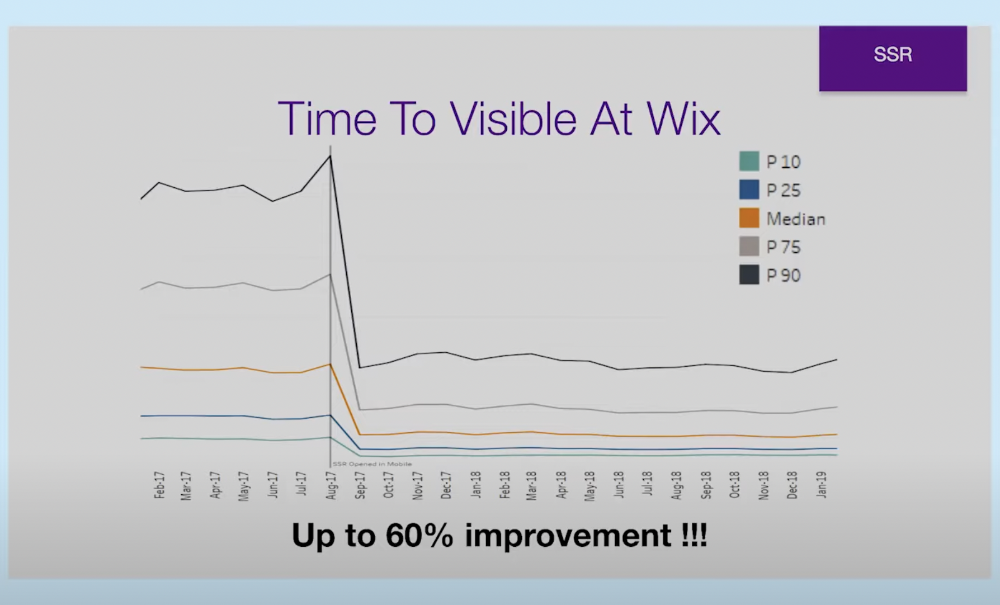

<BlankLayout>

# Next.js

The React Framework for Production

</BlankLayout>

---

## Yet Another Framework...

We should be critical of every dependency we use:

- Why do we need it?
- Can we solve the problem ourselves?
- Can we trust the provider?
- Are we bikeshedding?
- What's in it for me?

> A JavaScript framework is created every X minutes

---

## Looking Back

### Adoption Plan for React

- Building entire applications using React was the end goal
- However, the adoption plan for React was to:
  - Gradually transform your UI to use React, one part at a time
  - This is why React makes no assumptions about where it runs

> How should a production React App look like?

---

## The paradox of choice

<Block sx={{ maxWidth:'80%', minWidth: '980px'}}>

- Next.js
  - The React Framework for Production
- Remix
  - Build Better Websites. Create modern, resilient user experiences with web
    fundamentals.
- Astro
  - Build fast websites, faster. 🚀🧑‍🚀✨
- Vite
  - Next generation frontend tooling. It's fast!
- CRA
  - Set up a modern web app by running one command.
- Parcel
  - The zero configuration build tool for the web. 📦🚀
- Gastby
  - Build blazing fast, modern apps and websites with React

</Block>

---

## Framework competition is good

The extreme progression in these type of production frameworks,
has lead to other languages getting involved:

- `esbuild` written in Go
- `SWC` written in Rust

---

## The problem we are trying to solve

- Ship a React App, properly bundled
- Keep Webpack under control
- Code React from the start
- Development Experience, focus on business code
- Use any styling solution we want
- Be fast, speed is good

---

## The value proposition

Next.js is a flexible React framework that gives you building blocks to create fast web applications.

By framework, we mean Next.js handles the tooling and configuration needed for React,
and provides additional structure, features, and optimizations for your application.

We could say it is a Full Stack Web SDK, based on React.

---

## The elevator pitch

> **Next.js** gives you the **best developer experience** with
> all the features you need for **production**:
>
> - Hybrid static and server rendering,
> - **TypeScript** support,
> - Smart bundling,
> - Route pre-fetching, and more.
>
> **No config needed.**

---

## Features

- The Next server
- `Server Side Rendering` (SSR), both at build and runtime
- `Incremental Static Regeneration` (ISR)
- Dynamic Routes
- API Routes
- Built in Router
- Server, Client bundle separation
- `fetch` polyfill for server (and client)

---

## Even more features

- `_middleware`
- SEO without assumptions
- Static Site export, like `CRA`
- `next/image`
- `next/script`
- `CSS-in-JS` solutions can render stylesheets on the server
- Owned by Vercel

---

## Server Side Rendering

### Challenges and pitfalls

- Isomorphic JavaScript
- No window
- JavaScript Contexts
- Memory Leaks
- Time to Visible and Time to Interactive
- Divergent HTML

These are not problems with Next.js, these are just challenges in the SSR world.

---

## Isomorphic JavaScript

Also known as Universal JavaScript, where the
**first frame rendered on the client**,
must match the **frame rendered by the server**.

- Server generates dry HTML (sync)
- HTML + JS + CSS + assets send to client
- Client hydrates the HTML (sync)

> Suspense in React 18 improves how this is done, by breaking
> down your app into smaller independent units.

---

## Isomorphic JavaScript

- SEO works without assumptions
  - CSR SPA's depend on the Search Engine's to render the view
  - Open graph cards
- Works if JavaScript is disabled (for the most part)
- Time to visible performance
  - Fewer roundtrips
  - Fast servers
  - Hot servers (caching)
  - Faster data fetching
  - Server and client work together

---

## No window

SSR happens on the server, without window or DOM elements.

- Avoid initializing state based on window data
  - Use CSS to control responsive styles
- Avoid unguarded access to window or DOM elements
  - `typeof window !== 'undefined'`
- It is safe to access the window or DOM elements inside:
  - `useEffect`
  - Promises and event handlers (usually)
  - `useLayoutEffect` won't do anything

---

## No window

- [Next SSR isMobile control for component render](https://github.com/vercel/next.js/discussions/35392)
- [[SSR/OBS] SSR render components in wrong DOM place](https://github.com/vercel/next.js/discussions/35301)

<Card sx={{width: '80%', minWidth:'300px', maxWidth: '55ch', p: 0, mb:2 , '& > pre': { p: 1 }}}>

```ts
// Before
const isOBS = useMemo(
  () => (isBrowser ? navigator?.userAgent?.indexOf("OBS") !== -1 : false),
  [isBrowser]
);
```

</Card>

<Card sx={{width: '80%', minWidth:'300px', maxWidth: '55ch', p: 0, mb:2 , '& > pre': { p: 1 }}}>

```ts
// After
const [isOBS, setIsOBS] = useState(false);

useEffect(() => {
  setIsOBS(isBrowser ? navigator?.userAgent?.indexOf("OBS") !== -1 : false);
}, [isBrowser]);
```

</Card>

---

## JavaScript Context

- Global variables are shared to all users making requests to your site
- Sharing data between server and client is through serialization
  - You cannot pass a **Class** instance from the server to the client
  - You may accidentally serialize a **secrets**
- Code that uses **Node API**'s won't necessarily work on the client
  - Functions shared between server and client
  - `import { something } from '../my-lib'`

---

## Memory Leaks

- Server side memory leak
  - Might take several days/weeks to happen (usually on weekends)
  - Must restart the server
- A Browser memory leak
  - A really bad memory leak might be caught right away
  - Refreshing the window takes care of most
- [Memory leak #35526](https://github.com/vercel/next.js/discussions/35526)

---

## Time To Visible / Time To Interactive

- HTML is rendered on the server
  - Better Time To Visible metric
- Time To Interactive,
  - Doesn't improve much more
  - The client still has to prepare event listeners (hydration processe)
  - A visible UI, which doesn't respond, can frustrate users.

> React 18 has mitigations

---

## Divergent HTML

if **SSR HTML !== first CSR HTML** then **bugs will occur**.

Happens when you rely on timing, randomness, or have unguarded access to the DOM that fails, but does not crash the SSR process.

If you can't design it away, hide those divergent parts behind client side activated flags.

> React warns about this

---

## Divergent HTML

Generic trick to avoid rendering part of the JSX on the client.

<Card sx={{width: '80%', minWidth:'300px', maxWidth: '45ch', p: 0, mb:2 , '& > pre': { p: 1 }}}>

```jsx
function Parent() {
  const [showChild, setShowChild] = useState(false);
  // Wait until after client-side hydration to show
  useEffect(() => {
    setShowChild(true);
  }, []);

  // You can show some kind of placeholder UI here
  if (!showChild) return null;

  return <Child />;
}
```

</Card>

> If `Child` uses `useLayoutEffect`, this also helps out

---

## Divergent HTML

- [Both sides of ternary are rendered](https://github.com/vercel/next.js/discussions/34982)

<Card sx={{width: '80%', minWidth:'300px', maxWidth: '45ch', p: 0, mb:2 , '& > pre': { p: 1 }}}>

```jsx
return clientSecond === serverSecond ? (
  <div style={{ backgroundColor: "red" }}>RED</div>
) : (
  <div style={{ backgroundColor: "blue" }}>BLUE</div>
);
```

</Card>

> In practice it renders a RED div, with BLUE text!

---

## Success Story

### Wix.com



---

## Tool Box

- Anatomy of a `Next.js` project
- `_app` and `_document`
- Layouts
- SPA Routing
- Dynamic Routes
- API Routes
- SSR Techniques
- Code Elimination
- `_middleware`
- `next.config.js`

---

<MDXPSideLayout showSlideNum={false} split={4}>

## New project

In the standard configuration, there's a couple of
`magic` folders:

- `public`
- `pages`
- `pages/api`

Or use [Next-js-Boilerplate](https://github.com/ixartz/Next-js-Boilerplate).

<Card sx={{p: 0, '& > pre': { p: 1 }}}>

```bash
yarn create next-app --typescript
```

</Card>

<Card sx={{p: 0, '& > pre': { p: 1 }}}>

```shell
.
├── README.md
├── next-env.d.ts
├── next.config.js
├── node_modules
├── package.json
├── pages
│  ├── _app.tsx
│  ├── api
│  │  └── hello.ts
│  └── index.tsx
├── public
│  ├── favicon.ico
│  └── vercel.svg
├── styles
│  ├── Home.module.css
│  └── globals.css
├── tsconfig.json
└── yarn.lock
```

</Card>

</MDXPSideLayout>

---

<MDXPSideLayout showSlideNum={false} split={5}>

## File Structure

You can use `src` folder to group:

- `pages`
- `styles`
- `components`
- etc.

Config files must be at the root.

All Page components from `pages` must be default exports.

<Card sx={{p: 0, '& > pre': { p: 1 }}}>

```shell
.
├── README.md
├── next-env.d.ts
├── next.config.js
├── node_modules
├── package.json
├── public
│   ├── favicon.ico
│   └── vercel.svg
├── src
│   ├── pages
│   │   ├── _app.tsx
│   │   ├── api
│   │   │   └── hello.ts
│   │   └── index.tsx
│   └── styles
│       ├── Home.module.css
│       └── globals.css
├── tsconfig.json
└── yarn.lock
```

</Card>

</MDXPSideLayout>

---

<MDXPSideLayout showSlideNum={false} split={5}>

## Existing Project

Create a `pages` directory, and place
your routes inside it.

Add scripts to your `package.json`:

- `next dev`
- `next build`
- `next start`
- `next lint`

[Incremental adoption](https://nextjs.org/blog/incremental-adoption).

<Card sx={{p: 0, '& > pre': { p: 1 }}}>

```shell
yarn add next react react-dom --exact
yarn add --dev typescript @types/node @types/react --exact
touch tsconfig.json
```

</Card>

</MDXPSideLayout>

---

<MDXPSideLayout showSlideNum={false} split={3}>

## `_document`

All Next.js projects have a default `_document` component,
but you can customize it, by creating `pages/_document.tsx`.

- Rendered on the Server
  - Cannot put event handlers on tags
- Modify `html`, `body` and `head` for all pages
  - Class name on `body`
  - Collect styles for styled components
  - `lang` on `html`
  - Load fonts

<Card sx={{p: 0, '& > pre': { p: 1 }}}>

```tsx
// src/pages/_document.tsx
import { Html, Head, Main, NextScript } from "next/document";

export default function CustomDocument() {
  return (
    <Html>
      <Head />
      <body>
        <Main />
        <NextScript />
      </body>
    </Html>
  );
}

// or (important for the DEMO)
import Document, { DocumentContext } from "next/document";

class MyDocument extends Document {
  static async getInitialProps(ctx: DocumentContext) {
    const initialProps = await Document.getInitialProps(ctx);

    return initialProps;
  }
  // render is optional when extending Document
}

export default MyDocument;
```

</Card>

</MDXPSideLayout>

---

<MDXPSideLayout showSlideNum={false} split={3}>

## `_app`

Included by default in all Next.js projects,
but you can customize it by creating `pages/_app.tsx`.

- Persisting layout between page changes
- Keeping state when navigating pages
- Custom error handling using `componentDidCatch`
- Inject additional data into pages
- Add global CSS
- Runs both on the Server and Client

<Card sx={{p: 0, '& > pre': { p: 1 }}}>

```tsx
// src/pages/_app.tsx
import "nes.css/css/nes.min.css";
import type { AppProps } from "next/app";
import { ThemeProvider } from "styled-components";

import { AppContent } from "components/AppContent";
import { AppHeader } from "components/AppHeader";
import { Navigation } from "components/Navigation";
import { GlobalStyle, theme } from "styles/global";

function CustomApp({ Component, pageProps }: AppProps) {
  return (
    <ThemeProvider theme={theme}>
      <GlobalStyle />

      <AppHeader>
        <Navigation />
      </AppHeader>

      <AppContent>
        <Component {...pageProps} />
      </AppContent>
    </ThemeProvider>
  );
}

export default CustomApp;
```

</Card>

</MDXPSideLayout>

---

<MDXPSideLayout showSlideNum={false} split={3}>

## Per Page Layout

Because, React and friends are just JavaScript,
if you want to do layouts on a per page basis, all you have to do is:

- In the page with a specific layout:
  - Define a `getLayout` (arbitrary name) function
- In `_app`:
  - If `getLayout` exists, call it
  - Otherwise use a common layout

<Card sx={{mb:1,p: 0, '& > pre': { p: 1 }}}>

```tsx
import type { ReactElement } from "react";

const Page = () => <div>Hello</div>;

Page.getLayout = function getLayout(page: ReactElement) {
  return <section>{page}</section>;
};

export default Page;
```

</Card>

<Card sx={{p: 0, '& > pre': { p: 1 }}}>

```tsx
// src/pages/_app.tsx
import type { ReactElement, ReactNode } from "react";
import type { NextPage } from "next";
import type { AppProps } from "next/app";

type NextPageWithLayout = NextPage & {
  getLayout?: (page: ReactElement) => ReactNode;
};
type AppPropsWithLayout = AppProps & { Component: NextPageWithLayout };

function CustomApp({ Component, pageProps }: AppPropsWithLayout) {
  // Use the layout defined at the page level, if available
  const getLayout = Component.getLayout ?? ((page) => page);
  return getLayout(<Component {...pageProps} />);
}

export default CustomApp;
```

</Card>

</MDXPSideLayout>

---

<MDXPSideLayout showSlideNum={false} split={5}>

## SPA Routing

Pages in Next.js are associated to the their file name.

For example:

- `src/pages/contact.tsx` accessible at `/contact`,
- `src/pages/user/profile.tsx` accessible at `/user/profile`.

To transition between pages use `Link` from `next/link`.

### `next/link`

<Card sx={{p: 0, '& > pre': { p: 1 }}}>

```tsx
import Link from "next/link";

function Links() {
  return (
    <>
      <Link href="/contact">
        <a className="anchor-style">Contact</a>
      </Link>
      <Link href="/user/profile">
        <a className="anchor-style">Profile</a>
      </Link>
    </>
  );
}
```

</Card>

</MDXPSideLayout>

---

<MDXPSideLayout showSlideNum={false} split={5}>

## SPA Routing

The Next.js Router can be access from `next/router`:

- `Router`
- `useRouter`
- `withRouter`

The Router gives access to the current route, queries, events, and
methods for imperative navigation.

It is recommended to use `useRouter`, while `Router` can be used to attach
event listeners on persistent layouts.

### `next/router`

<Card sx={{p: 0, '& > pre': { p: 1 }}}>

```tsx
import { useEffect } from "react";
import type { AppProps } from "next/app";
import Router from "next/router";
import NProgress from "nprogress";

Router.events.on("routeChangeStart", () => NProgress.start());
Router.events.on("routeChangeComplete", () => NProgress.done());
Router.events.on("routeChangeError", () => NProgress.done());

function App({ Component, pageProps }: AppProps) {
  useEffect(() => {
    const handler = (url: string) => pageview(url);
    Router.events.on("routeChangeComplete", handler);

    return () => Router.events.off("routeChangeComplete", handler);
  }, []);

  return <MyAppRoot />;
}

export default App;
```

</Card>

</MDXPSideLayout>

---

<MDXPSideLayout showSlideNum={false} split={3}>

## SPA Routing

Notable router properties and methods:

- `pathname`
  - actual path in `src/pages`
- `query`
  - As a plain object
- `asPath`
  - path visible in the browser
- `push`
- `replace`
- `events`

### `next/router`

<Card sx={{p: 0, '& > pre': { p: 1 }}}>

```tsx
import { useRouter } from "next/router";

export function ActiveLink({ children, href }) {
  const router = useRouter();
  const className = router.asPath === href ? "link link-active" : "link";

  const handleClick = (e) => {
    e.preventDefault();
    router.push(href);
  };

  return (
    <a href={href} onClick={handleClick} className={className}>
      {children}
    </a>
  );
}
```

</Card>

</MDXPSideLayout>

---

<MDXPSideLayout showSlideNum={false} split={3}>

## Dynamic Routes

Not all pages can be statically defined from the beginning.

- `pages/post/[slug].tsx`
  - `/post/hello`
- `pages/post/[...slug].tsx`
  - `/post/2022/03/31/hello`
  - `/post/2020/08/hello`
- `pages/post/[[...slug]].tsx`
  - `/post`
  - `/post/2022/03/31/hello`

<Card sx={{p: 0, '& > pre': { p: 1 }}}>

```tsx
import { useRouter } from "next/router";

// const slug: string | string[] | undefined
const Post = () => {
  const router = useRouter();
  // without `getStaticPaths`, query is empty on first render
  const { slug } = router.query;
  console.log(slug);
  return <p>Post: {slug}</p>;
};

export default Post;
```

</Card>

`/post/[slug].tsx`

<Card sx={{p: 0, '& > pre': { p: 1 }}}>

```shell
> undefined
> hello
```

</Card>

`/post/[...slug].tsx`

<Card sx={{p: 0, '& > pre': { p: 1 }}}>

```shell
> undefined
> ['2022', '03', '31', 'hello']

```

</Card>

</MDXPSideLayout>

---

<MDXPSideLayout showSlideNum={false} split={6}>

## API Routes

Located inside `pages/api`. These are treated as API endpoints, rather than pages.

These exist only server-side, and can also be Dynamic.

You can access 3rd party services that require an API KEY, without having to
leak your KEY to the client.

You can also use these to hide URL's of services.

These have access to entire Node.JS API.

<Card sx={{p: 0, '& > pre': { p: 1 }}}>

```tsx
// src/pages/api/wild.ts
import type { NextApiRequest, NextApiResponse } from "next";

import { SUPPORTED_POKEMON } from "lib/constants";
import { fetchPokemon } from "lib/pokemon";
import type { Pokemon, Message } from "types";

export async function wildPokemon(
  req: NextApiRequest,
  res: NextApiResponse<Pokemon | Message>
) {
  if (req.method !== "GET")
    return res.status(404).json({ message: "Not Found" });
  try {
    const id = 1 + Math.floor(Math.random() * SUPPORTED_POKEMON);

    const data = await fetchPokemon(id);

    return res.status(200).json(data);
  } catch (e) {
    return res.status(500).json({ message: "Internal Server Error" });
  }
}

export default wildPokemon;
```

</Card>

</MDXPSideLayout>

---

## Types of SSR

- During Build Time: `next build`
- During Runtime: `next start`
- Next.js polyfills `fetch` on server
- You can share code between API routes and SSR

Controlled from `src/pages` level, based on what each page exports.

Automatic, `getStaticProps`, `getStaticPaths`, `getServerSideProps`.

> `getInitialProps` is no longer recommended

---

## Build Time SSR

Just export a component as default from a `page`, or you can fetch data for your pages, at build time, by using:

- `getStaticProps`
- `getStaticPaths`

---

## Runtime SSR

You can fetch data and build more pages when the server is already deployed.

- On Demand
  - `getServerSideProps`
- Incrementally
  - `getStaticProps` and `getStaticPaths` with fallback

---

<MDXPSideLayout showSlideNum={false} split={5}>

## Automatic

Next.js calculates that a page like this,
can be rendered at build time, because:

- No `getInitialProps`
- No `getServerSideProps`

The page can still use client side JavaScript to fetch
more data and update some of its elements.

`getInitialProps` in `_app`, disables this behavior!
Except for pages with `getStaticProps`.

<Card sx={{p: 0, '& > pre': { p: 1 }}}>

```tsx
// src/pages/index.tsx
import Head from "next/head";
import useSWR from "swr";

const Home = () => {
  const { data } = useSWR("some-data", fetcher);

  return (
    <>
      <Head>
        <title>Hello</title>
      </Head>

      <section>
        <p>Hello World!</p>
      </section>
    </>
  );
};

export default Home;
```

</Card>

</MDXPSideLayout>

---

<MDXPSideLayout showSlideNum={false} split={2}>

### `getStaticProps`

- The data required to render the page is available at build time
  - Ahead of a user's request
  - The data comes from a headless CMS
  - The data can be publicly cached (not user-specific)
- The page must be pre-rendered (for SEO) and be very fast
  - Generates HTML and JSON, which can be cached by a CDN for performance
- `getStaticProps` can ONLY be exported from a page.
- Always runs during `next build`

<Card sx={{p: 0, '& > pre': { p: 1 }}}>

```tsx
// src/pages/posts.tsx
import type { GetStaticProps, InferGetStaticPropsType } from "next";
import { getPosts } from "lib/posts";

// This function gets called at build time on server-side.
export const getStaticProps: GetStaticProps<Post[]> = async () => {
  // Use an external API to get posts.
  const posts = await getPosts("https://.../posts");

  // Return { props: { posts } }, as props to Blog at build time
  return {
    props: {
      posts,
    },
  };
};

// posts will be populated at build time by getStaticProps()
function Blog({ posts }: InferGetStaticPropsType<typeof getStaticProps>) {
  return <PostList posts={posts} />;
}

export default Blog;
```

</Card>

</MDXPSideLayout>

---

<MDXPSideLayout showSlideNum={false} split={4}>

### `getStaticPaths`

- When you have dynamic pages, which use `getStaticProps`, you must use `getStaticPaths`
- Enables `ISR` with `fallback: true`, `fallback: 'blocking'`

Values of `fallback` control `ISR`:

- `true`, allows generation at runtime
  - Allows showing a fallback
  - `getStaticProps` might return 404
- `false`, directly returns 404
- `blocking`, same as true, but
  - No fallback UI

<Card sx={{p: 0, '& > pre': { p: 1 }}}>

```tsx
// src/pages/pokemon/[id].tsx
const initial = [1, 4, 7];

export const getStaticPaths: GetStaticPaths = () => {
  const paths = initial.map((id) => ({ params: { id: `${id}` } }));
  return { paths, fallback: true };
};

export const getStaticProps: GetStaticProps<PokeProps> = async (ctx) => {
  const id = Number(ctx.params?.id);
  if (Number.isNaN(idx)) return { notFound: true };

  try {
    const pokemon = await fetchPokemon(idx);
    return { props: { pokemon }, revalidate: 900 };
  } catch (e) {
    return { notFound: true, revalidate: 500 };
  }
};

const PokeView = ({ pokemon }: PokeViewProps) => {
  const router = useRouter();
  if (router.isFallback) return <div>Loading...</div>;

  return <PokeCard pokemon={pokemon} />;
};

export default PokeView;
```

</Card>

</MDXPSideLayout>

---

<MDXPSideLayout showSlideNum={false} split={4}>

### `getServerSideProps`

Export a function called `getServerSideProps` from a page,
Next.js pre-renders the page on each request using the data
returned by `getServerSideProps`.

This is useful if you want to fetch data that changes often,
and have the page update to show the most current data.

- Never runs on the browser
- `getServerSideProps` can only be exported from a page.
- Possible, but inefficient, to call `api/routes` from here,
  call your CMS, database, or whatever you need, directly.

<Card sx={{p: 0, '& > pre': { p: 1 }}}>

```tsx
import type { InferGetServerSidePropsType } from "next";

export const getServerSideProps = async (ctx) => {
  const token = ctx.req.cookies[USER_TOKEN];

  const data = await deriveFromToken(token);

  // if ("status" in data)
  //   return { redirect: { destination: "/", permanent: false } };
  if ("status" in data) return { notFound: true };

  const collection = data.pokemonDb;

  return { props: { collection } };
};

export const PokeCollection = ({
  collection,
}: InferGetServerSidePropsType<typeof getServerSideProps>) => {
  return <CollectionGrid collection={collection} />;
};

export default PokeCollection;
```

</Card>

</MDXPSideLayout>

---

## TypeScript in SSR

<Card sx={{p: 0, '& > pre': { p: 1 }, maxWidth:'55ch'}}>

```tsx
type Redirect =
  | { destination: string; basePath?: false } & (
      | { statusCode: 301 | 302 | 303 | 307 | 308 }
      | { permanent: boolean }
    );

type GetStaticPropsResult<P> =
  | { props: P; revalidate?: number | boolean }
  | { redirect: Redirect; revalidate?: number | boolean }
  | { notFound: true; revalidate?: number | boolean };

type GetServerSidePropsResult<P> =
  | { props: P | Promise<P> }
  | { redirect: Redirect }
  | { notFound: true };

type GetStaticPathsResult<P extends ParsedUrlQuery = ParsedUrlQuery> = {
  paths: Array<string | { params: P; locale?: string }>;
  fallback: boolean | "blocking";
};
```

</Card>

---

## [`next-code-elimination.vercel.app`](https://next-code-elimination.vercel.app/)

<iframe
  src="https://next-code-elimination.vercel.app/"
  style={{ width: "80%", height: "80%", minWidth: "300px", maxWidth: "2560px" }}
/>

---

<MDXPSideLayout showSlideNum={false} split={4}>

## `_middleware`

It's in Beta, since Next.js `12.0.9`

- Code over configuration
- Runs before all siblings in `pages`
- Runs at the (Vercel\*) Edge
  - Zero cold start Functions
  - Geographically close to visitors
- You can modify responses by
  - rewriting
  - redirecting
  - adding headers
  - adding/removing queries

\*V8 Runtime with a limited set of APIs. In dev mode the code runs in a sandbox environment emulator.

<Card sx={{p: 0, '& > pre': { p: 1 }}}>

```ts
// src/pages/_middleware.ts
import { NextRequest, NextResponse } from "next/server";

export const middleware = (req: NextRequest) => {
  const { pathname } = req.nextUrl;
  // prevent direct access to `/api/sms`
  if (pathname.startsWith("/api/sms")) {
    return new Response(null, { status: 404, statusText: "Not Found" });
  }

  if (
    pathname.startsWith("/api") || //  exclude all API routes
    pathname.startsWith("/static") || // exclude static files
    pathname.includes(".") // exclude all files in the public folder
  ) {
    return NextResponse.next();
  }

  if (pathname === "/hello-sms") {
    const url = req.nextUrl;
    url.pathname = "/api/sms";
    return NextResponse.rewrite(url);
  }

  return NextResponse.next();
};
// export default middleware; // optional
```

  </Card>

</MDXPSideLayout>

---

## `next.config.js`

<Card sx={{width: '80%', minWidth:'300px', maxWidth: '1580px', p: 0, '& > pre': { p: 1 }}}>

```js
/** @type {import('next').NextConfig} */
const nextConfig = {
  poweredByHeader: false,
  reactStrictMode: true,
  images: {
    domains: ["raw.githubusercontent.com"],
  },
  compiler: {
    styledComponents: true,
  },
  webpack(config, { isServer }) {
    return config;
  },
  // rewrites, redirects, map headers
};

module.exports = nextConfig;
```

</Card>

---

## Client Side Escape Hatch

If you don't have a server, you can use `next export` to build a Static HTML Export,
which can be used as a standalone application, without a Node.js server.

However, you'll miss out on a bunch of features, include, but not limited to:

- Image optimizations
- API Routes
- `ISR`
- `_middleware`
- `getServerSideProps`

---

## Env vars

- Load them from :
  - `.env.local` (overrides all)
  - `.env` (always used)
  - `.env.development` (overrides dev)
  - `.env.production` (overrides prod)
- `NEXT_PUBLIC_` env vars are available on the client
- Everything else is `undefined` on the client

---

## Left out

- Dynamic Imports
- Middleware for `api` routes (not `_middleware`)
- `next/image` and `next/script`
- Testing with `rtl`, `ts-mockito`, `MSW`, and friends.
- Authentication patterns
- 3rd party: MDX, `next-runtime`, `next-connect`
- React 18 and Server Components Preview
- Incremental Static Regeneration, on detail
- Using React Dev Tools
- Error Handling
- @next/bundle-analyzer

---

## Demo Time

- Four pages
  - Landing
  - Single Pokémon
  - Pokémon Capture
  - Pokémon Collection
- API routes
  - Capture
  - Wild encounter

Uses `_middleware` to control `app-cookie`.

---

## Wrap up

- React is a means to an end
- Next.js builds on top of React's responsibilities
- Data fetching, routing, API routes, and optimizations
- All batteries included
- Ever growing community
- Constant updates, with fixes and new features
- A good place to deploy, Vercel
